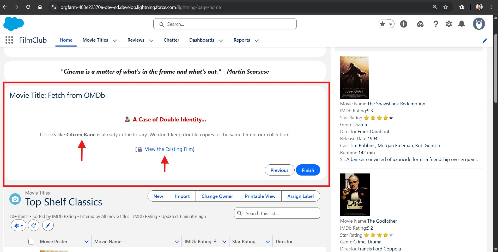
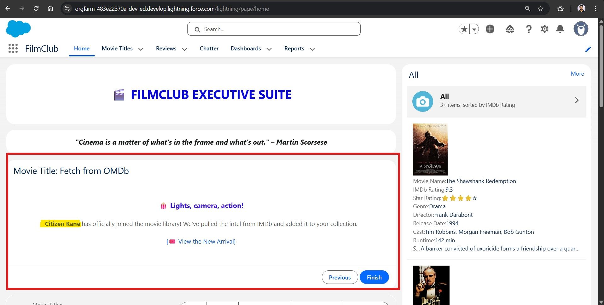

## [Unreleased]

### 🚀 Planned Features
- **Home Page Quick Stats Bar:** A dashboard-style component to display total movie count and average ratings for high-level visibility.
- **Agentforce Service Agent:** Implementing an autonomous agent grounded in Data Cloud to handle member FAQ and RSVP management.
- **OMDb Error Handling:** Adding a "Movie Not Found" logic branch to prevent empty record creation when the API returns no results.

---
# 🎞️ FilmClub App: Changelog

## [1.2.0] - 2026-01-22
### 📽️ Enhancing User Experience (UX) in FilmClub Flow

**Overview**
This update focuses on the transition from a "Utility-First" interface to a "Brand-Aligned" experience. The goal was to ensure that the FilmClub application felt like a curated cinematic tool rather than a standard database entry form.

### The Problem: The Visibility Gap

Previously, the Flow contained a `Check for Existing Movie` Get Records element. However, when a duplicate was found, the Flow would simply end.

- **The User Perspective:** "I typed the movie name, clicked next, and... nothing happened. Did it save? Did it crash?"
- **The Technical Reality:** The Flow worked perfectly, but the Communication Layer was missing.

### The Solution: The "Cinephile" Feedback Loop

I transformed a dead-end path into a Guided Experience by inserting a custom Screen element specifically for duplicates.

#### 1. "The Detective Noir" Alert

Instead of a generic error, I used themed branding:

""_🕵️ A Case of Double Identity... It looks like {!Movie_Title_Search} is already in the library._""

#### 2. The "Smart-Link Shortcut"

The most critical UX addition was the **Direct Navigation Link**.

- __Feature:__ A dynamic hyperlink using the record ID found during the search phase.
- __Logic:__ `/lightning/r/Movie_T__c/{!Check_for_Existing_Movie.Id}/view`.
- __Benefit:__ It saves the user from having to exit the Flow, go to the Movie tab, and search manually. It turns a "Stop" into a "Shortcut."

### Key Results

- __User Confidence:__ Users now receive immediate confirmation that the movie is already safe in the "Vault".
- __Data Integrity:__ Users are naturally discouraged from trying to force a duplicate entry.
- __Professional Finish:__ The app feels like a cohesive product rather than a series of disconnected screens.

---

## [1.1.0] - 2026-01-22
### ✨ Designing the "Success Feedback Loop" in FilmClub Flow

### The Problem: The "Black Box" Submission

Initially, after the OMDb API call and the Create Records step, the Flow would simply terminate or reset.

- **The User Perspective:** "Did the IMDb data actually load? Where did my movie go? Is the record created?".
- **The Technical Reality:** The record was successfully committed to Movie_T__c, but there was no visual confirmation or bridge to the new data.

### The Solution: The "Feature Presentation" Success Screen

I implemented a high-energy, branded confirmation screen to celebrate the new entry into the FilmClub.

#### 1. Branded Affirmation

To maintain the "Cinephile" persona of the app, I used evocative language:

"_🍿 Lights, camera, action! {!Movie_Title_Search} has officially joined the movie library! We’ve pulled the intel from IMDb and added it to your collection._"

#### 2. The "New Arrival" Dynamic Link

I utilized the variable `vCreatedMovieID` (which captures the ID of the record just created by the Flow) to build a one-click shortcut.
- **Feature:** A dynamic hyperlink directly to the new movie record.
- **Logic:** `/lightning/r/Movie_T__c/{!vCreatedMovieID}/view`.
- **Benefit:** It provides immediate gratification, allowing the user to see their "work" (the fetched Poster URL, Plot, and Year) instantly without navigating the Salesforce Object home page.

### Key Results
- **Instant Gratification:** Users see the tangible result of the API integration immediately.
- **Reduced Navigation Friction:** The "Time-to-Record" is reduced to a single click.
- **Professional Polishing:** The app feels reactive and alive, reflecting a modern SaaS (Software as a Service) experience.

---

