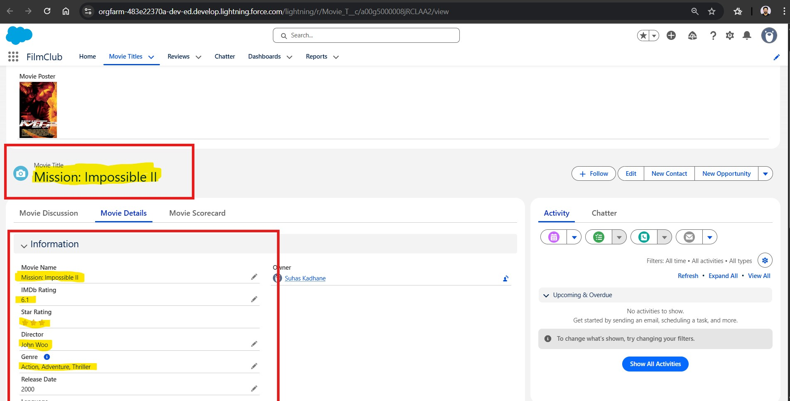

# **📘 Technical Case Study: Data Integrity & API Matching Anomaly**

**Issue Overview**

During the implementation of the OMDb API integration, a "Silent Data Failure" was identified. When a user enters a movie title that does not exactly match the IMDb primary title (e.g., entering `Mission Impossible: 2` instead of the official `Mission: Impossible II`), the system creates a "Shell Record."

**The "Shell Record" Phenomenon**

- **User Input:** `Mission Impossible: 2`
- **API Behavior:** The OMDb API returns a JSON response: `{"Response":"False","Error":"Movie not found!"}`.
- **Salesforce Behavior:** The Flow continues to the `Create Records` element. Since the API variables are empty (null), Salesforce creates a record with the user's input as the Name, but all other fetched fields (Year, Plot, Poster URL, Rating) remain Blank.

**Anomaly Examples**

**1. The Incorrect Movie Name** 

  

**2. The Correct Movie Name**

  

---

**Technical Root Cause**

The OMDb API is a **literal-string matching service**. It does not currently utilize "Fuzzy Logic" for basic search queries. If the string contains incorrect punctuation or Roman numeral variations, the API fails to return an object. Because the Flow was not originally configured with a Fault Path or a Response Validation check, it proceeded to commit an incomplete record to the `Movie_T__c` object.

**Key Learning & Professional Takeaway**

This anomaly highlighted the critical need for External Data Validation. In a production environment, "Dirty Data" (incomplete records) can skew reporting and break UI components (like Lightning Web Components that expect a Poster URL).

---

**Proposed Architectural Solution (The "Guardrail")**

To prevent this, I am implementing a Validation Decision node immediately following the API call:

1. **Logic:** Check if the `Title` variable returned by the API is `Global Constant: Null`.
2. **Action:** If Null, redirect the user to a "Cinematic Intel Not Found" screen to prompt a spelling check.
3. **Result:** Ensures 100% Data Integrity within the FilmClub library.
