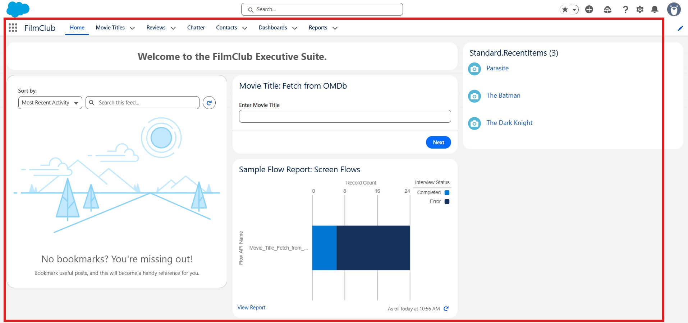
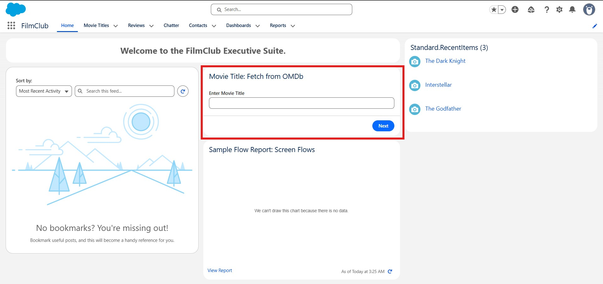
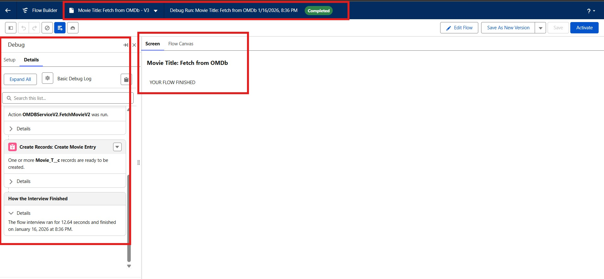
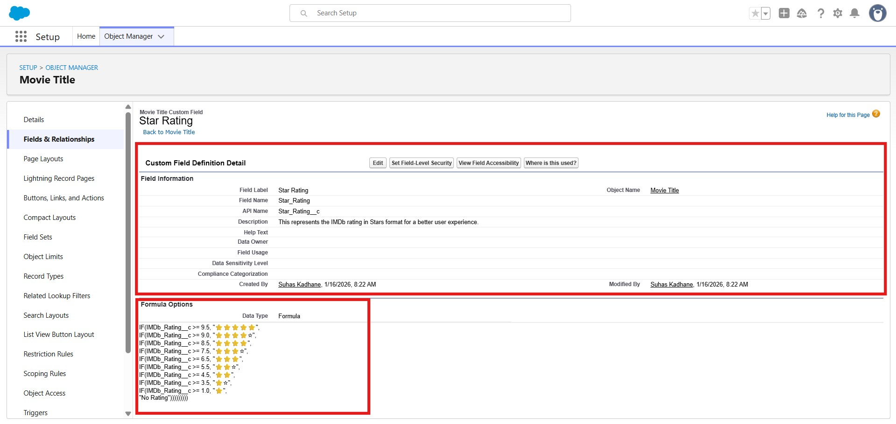
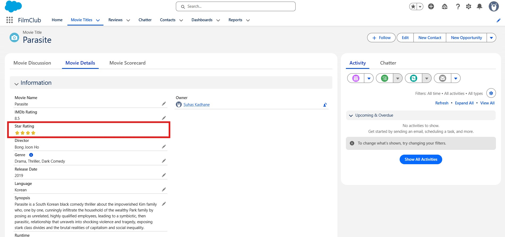

# 🎬 FilmClub – Salesforce Movie Library App  
> *“The first rule of FilmClub is: You MUST talk about films!”*

FilmClub is a custom **Salesforce Lightning application** built to manage a personal movie library. It evolves from a manual data-entry tool into an **automated, API-integrated cinema hub** that fetches real-time movie data.

This project marks my **first deep dive into Salesforce development**, covering object modeling, UI customization, advanced __Flow Builder__ logic, and __REST API__ integration.

---

## 📝 Project Identity

- Developer: [__Suhas Kadhane__]
- Platform: Salesforce Developer Edition with Agentforce and Data Cloud
- Goal: To transform a manual cinema tracking tool into an automated, API-driven library using Salesforce Flow and OMDb.

## 🎥 Overview

FilmClub allows users to:
- Discover and store movies in Salesforce  
- Automatically fetch movie details using the **OMDb API**  
- Review, rate, and discuss films using **Chatter**  
- Visualize IMDb ratings with a **precision star-rating system**

The app demonstrates how Salesforce can be transformed beyond CRM into a **personalized, automated content platform**.

## 📺 Demo

**New UI/UX Update [Jan 22 Build]**

**Second Build with UI/UX Enhancement**

**First Basic Build**

---

## 🚀 Key Features

### 1️⃣ The Movie Core (Object Modeling)
- **Custom Object**: `Movie Title` to store cinema data  
- **Dynamic UI**: Lightning Record Pages displaying movie posters via formula fields  
- **Social Cinema**: Salesforce Chatter enabled for movie discussions  
- **Reviews & Scores**:
  - Rich-text reviews  
  - Custom numeric and calculated rating fields  

---

### 2️⃣ The “Librarian” (OMDb API Integration)
The heart of the app is a **Lightning Screen Flow** automates movie creation:

- **Secure Integration**
  - __External Services:__ Connected Salesforce to the __OMDb API__ using __Named Credentials__ and __External Credentials & Principals__ for secure authentication.

- **Duplicate Protection**
  - Built a "Search the Library" step uses a __Decision Element__ to check whether a movie already exists before calling the API, ensuring there are no duplicates in the library.

- **Automated Data Mapping**
  - The flow automatically maps API responses directly into Salesforce fields for Director, Cast, Plot, Release Date, and Poster URL etc.  

---

### 3️⃣ The Critic’s Precision (Star Ratings)
A high-accuracy **Formula Field based on star rating system** that converts numerical scores into a visual 10-point star system:

- Converts IMDb numeric scores into a **10-point visual star scale**
- Enforces **strict threshold logic**
- Supports **half-stars** (example: ⭐⭐⭐✫)
- Built using **advanced nested Salesforce formulas**

---

## 🛠️ Tech Stack

| Area | Technology |
|----|----|
| Platform | Salesforce Developer Edition |
| Automation | Lightning Flow Builder (Screen Flows) |
| Integration | REST API (OMDb), OpenAPI 3.0 Schema |
| Security | Named Credentials, External Credentials |
| User Interface | Lightning App Builder, Dynamic Forms |
| Logic | Advanced Salesforce Formula Fields |

---

## ⚙️ Setup & Installation

### Prerequisites
- Salesforce **Developer Edition** org  
- OMDb API key (https://www.omdbapi.com/)  
- System Administrator access  

---

### Step 1: Create Custom Object
- Create a custom object: `Movie_Title__c`
- Add fields for:
  - Movie Name 
  - IMDb Rating
  - Director
  - Genre
  - Cast
  - Runtime
  - Plot/Synopsis
  - Release Date
  - Poster URL
  - Review (Rich Text)

---

### Step 2: Configure API Access
1. Create **External Credential**
2. Create **Named Credential** linked to OMDb
3. Assign **Permission Set** to allow:
   - External Credential Principal access  
4. Verify API key activation

---

### Step 3: Build Lightning Screen Flow
- Input: Movie Name
- Decision Element: Check for duplicates
- HTTP Callout to OMDb API
- Map API response fields to Salesforce fields
- Create new Movie record

---

### Step 4: UI Customization
- Configure Lightning Record Page
- Display movie posters using formula image URLs
- Enable Chatter on Movie records
- Optimize layout for desktop and mobile

---

## 🏗️ Project Timeline & Evolution

### Phase 1: The Foundation
- Built the __FilmClub__ Lightning App.
- Defined core schema: Names, Ratings, and Poster URLs.
- Customized the __Home Tab__ for a personalized user experience.
- Manually created initial records like _Soap_ to test data integrity and layout.

---

### Phase 2: Integration (Connecting the Pipes)
- Registered and activated OMDb API keys.
- Configured __Permission Sets__ to allow the System Administrator to access External Credentials & Principals.
- Debugged API callouts and variable mapping.
- Resolved "Unhandled Fault", `401 Unauthorized` and Flow faults by debugging API callouts and mapping variables correctly.

---

### Phase 3: Intelligence & Polish
- Added __Duplicate Detection__ logic to prevent redundant records.
- Implemented __Star Rating__ visual system to replace raw numbers.
- Optimized UI & Record Pages for mobile and desktop viewing performance and usability.

---

## 📸 Screenshots & Visuals.

### Home Page

### Movie Record Page

### Lightning Screen Flow

### Star Rating Formula

### Star Rating Output

---

## 🧠 Lessons Learned

- **API Security**: Learned the importance of Permission Sets and Principals when working with External Credentials.
- **Flow Debugging**: Mastered the Flow Debugger to trace "401 Unauthorized" errors back to API key activation and callout failures.
- **Data Integrity**: Unerstanding that a "small decimal change can impact logic outcomes" leading to the implementation of strict decimal-based formulas.  
- **Salesforce Flexibility**: Learned that CRM can be adapted for creative, non-traditional use cases.

---

## 🌟 Acknowledgments

This project was built as a deeper journey into the Salesforce development ecosystem, proving that the right logic and a bit of "FilmClub" spirit, you can turn a CRM into a powerful, automated entertainment hub.
